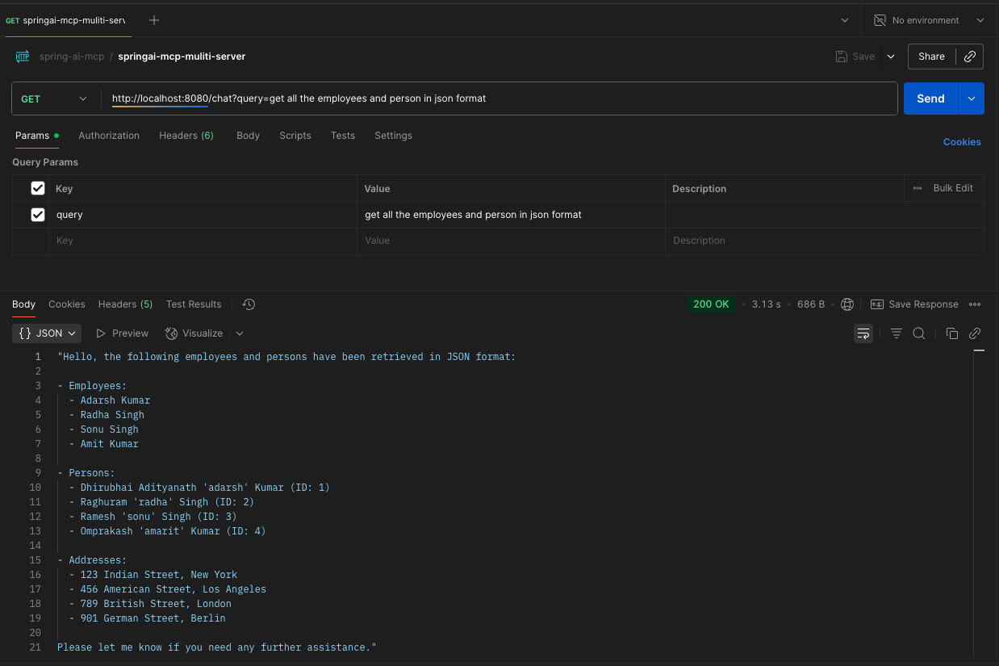

# springboot-mcp-client

---

* ollama run llama3.2:1b
```
ollama run llama3.2:1b
pulling manifest 
pulling 74701a8c35f6: 100% ▕█████████████████████████████████████████████████████████████████████████████████████████████████████████▏ 1.3 GB                         
pulling 966de95ca8a6: 100% ▕█████████████████████████████████████████████████████████████████████████████████████████████████████████▏ 1.4 KB                         
pulling fcc5a6bec9da: 100% ▕█████████████████████████████████████████████████████████████████████████████████████████████████████████▏ 7.7 KB                         
pulling a70ff7e570d9: 100% ▕█████████████████████████████████████████████████████████████████████████████████████████████████████████▏ 6.0 KB                         
pulling 4f659a1e86d7: 100% ▕█████████████████████████████████████████████████████████████████████████████████████████████████████████▏  485 B                         
verifying sha256 digest 
writing manifest 
success 
>>> Send a message (/? for help)

```

* api call
```
curl --location 'http://localhost:8080/chat?query=my%20name%20is%20adarsh%20'
```


* to build: `mvn clean package`
* to run: `java -jar target/springboot-mcp-client-0.0

