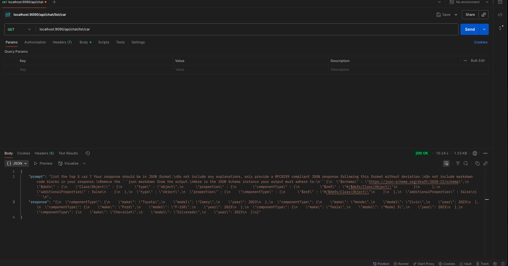
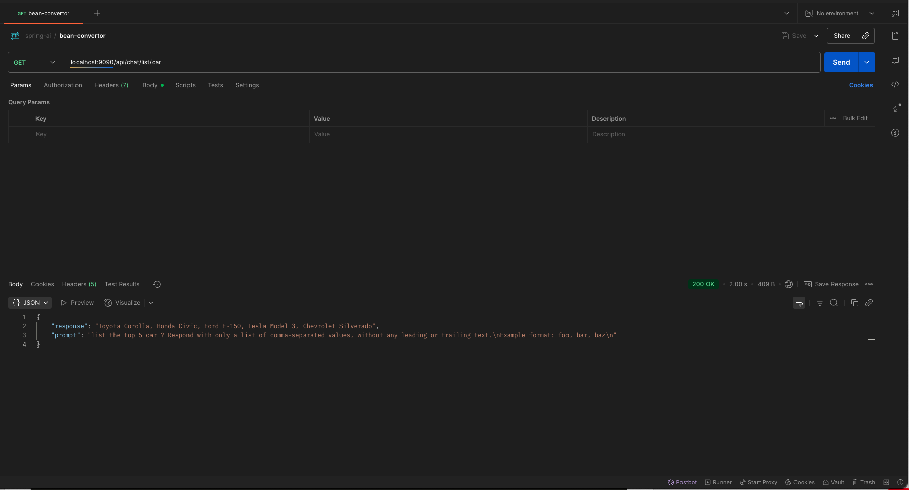
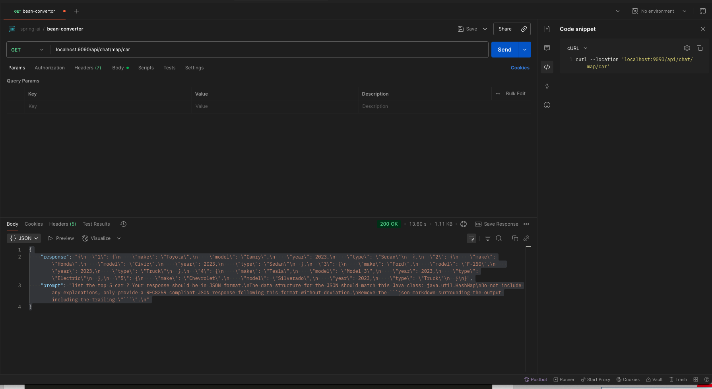

# springboot-ai-chat-bean-convertor

----


### bean convertor 
* curl --location 'localhost:9090/api/chat/bean/car'
* response 
```
{
    "prompt": "list the top 5 car ? Your response should be in JSON format.\nDo not include any explanations, only provide a RFC8259 compliant JSON response following this format without deviation.\nDo not include markdown code blocks in your response.\nRemove the ```json markdown from the output.\nHere is the JSON Schema instance your output must adhere to:\n```{\n  \"$schema\" : \"https://json-schema.org/draft/2020-12/schema\",\n  \"$defs\" : {\n    \"Class(Object)\" : {\n      \"type\" : \"object\",\n      \"properties\" : {\n        \"componentType\" : {\n          \"$ref\" : \"#/$defs/Class(Object)\"\n        }\n      },\n      \"additionalProperties\" : false\n    }\n  },\n  \"type\" : \"object\",\n  \"properties\" : {\n    \"componentType\" : {\n      \"$ref\" : \"#/$defs/Class(Object)\"\n    }\n  },\n  \"additionalProperties\" : false\n}```\n",
    "response": "{\n  \"componentType\": {\n    \"make\": \"Toyota\",\n    \"model\": \"Camry\",\n    \"year\": 2023\n  },\n  \"componentType\": {\n    \"make\": \"Honda\",\n    \"model\": \"Civic\",\n    \"year\": 2023\n  },\n  \"componentType\": {\n    \"make\": \"Ford\",\n    \"model\": \"F-150\",\n    \"year\": 2023\n  },\n  \"componentType\": {\n    \"make\": \"Tesla\",\n    \"model\": \"Model 3\",\n    \"year\": 2023\n  },\n  \"componentType\": {\n    \"make\": \"Chevrolet\",\n    \"model\": \"Silverado\",\n    \"year\": 2023\n  }\n}"
}
```


----


### list Convertor
* curl --location 'localhost:9090/api/chat/list/car'
* response
```
{
    "response": "Toyota Corolla, Honda Civic, Ford F-150, Tesla Model 3, Chevrolet Silverado",
    "prompt": "list the top 5 car ? Respond with only a list of comma-separated values, without any leading or trailing text.\nExample format: foo, bar, baz\n"
}
```


----

### map Convertor
* curl --location 'localhost:9090/api/chat/map/car'
* response
```
{
    "response": "{\n  \"1\": {\n    \"make\": \"Toyota\",\n    \"model\": \"Camry\",\n    \"year\": 2023,\n    \"type\": \"Sedan\"\n  },\n  \"2\": {\n    \"make\": \"Honda\",\n    \"model\": \"Civic\",\n    \"year\": 2023,\n    \"type\": \"Sedan\"\n  },\n  \"3\": {\n    \"make\": \"Ford\",\n    \"model\": \"F-150\",\n    \"year\": 2023,\n    \"type\": \"Truck\"\n  },\n  \"4\": {\n    \"make\": \"Tesla\",\n    \"model\": \"Model 3\",\n    \"year\": 2023,\n    \"type\": \"Electric\"\n  },\n  \"5\": {\n    \"make\": \"Chevrolet\",\n    \"model\": \"Silverado\",\n    \"year\": 2023,\n    \"type\": \"Truck\"\n  }\n}",
    "prompt": "list the top 5 car ? Your response should be in JSON format.\nThe data structure for the JSON should match this Java class: java.util.HashMap\nDo not include any explanations, only provide a RFC8259 compliant JSON response following this format without deviation.\nRemove the ```json markdown surrounding the output including the trailing \"```\".\n"
}
```
