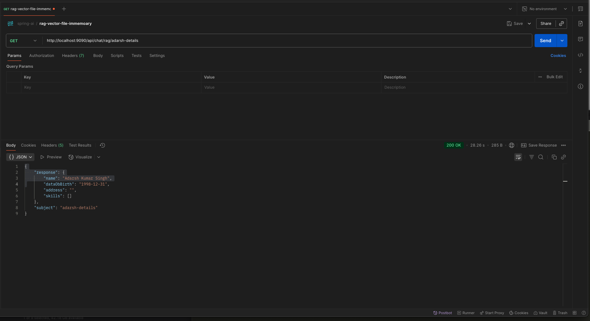

# springboot-ai-chat-rag-vector-inmemo-file

----



* api call
 *  curl --location 'http://localhost:9090/api/chat/rag/easpark-adarsh-details'
```
{
    "subject": "easpark-adarsh-details",
    "response": "distance: 0.1410090678875684\ncharset: UTF-8\nsource: dataStore.txt\n\n\nEspark Adarsh – Detailed Professional Summary\n\nEspark Adarsh is the professional and educational initiative led by Adarsh Kumar, an accomplished software architect and technology mentor based in Dallas, Texas. With over a decade of experience in enterprise software development, cloud-native architecture, and DevOps, Adarsh has created Espark Adarsh as a platform to share his expertise with developers, architects, and technology enthusiasts worldwide.\n\nThrough his GitHub repositories, blog content, and open educational material, Espark Adarsh embodies a mission to empower others to build scalable, secure, and maintainable systems using modern software practices and technologies.\n\nAbout the Creator – Adarsh Kumar\n\nAdarsh Kumar is a highly skilled and certified IT professional with broad experience in software engineering, enterprise architecture, and cloud computing. He holds the following professional certifications:\n- Project Management Professional (PMP)\n- AWS Certified Solutions Architect\n- Oracle Certified Java Web Services Developer\n\nHe has worked extensively with Fortune 500 companies and global enterprises, delivering complex, distributed systems with high reliability and performance. His core strength lies in solving real-world business challenges with clean architecture, automation, and robust DevOps pipelines.\n\nCore Technical Expertise\n\nAdarsh’s technical foundation is grounded in Java and the Spring ecosystem, but his capabilities extend across the full stack of enterprise systems:\n\nBackend & Integration\n- Java (8/11/17), Spring Boot, Spring Cloud, Spring Security\n- RESTful API design, GraphQL, SOAP Web Services\n- Apache Camel, Kafka, RabbitMQ, JMS\n- MySQL, Oracle, MongoDB, Cassandra\n\nCloud & DevOps\n- AWS (EC2, S3, Lambda, RDS, CloudWatch, ECS)\n- Google Cloud Platform, Pivotal Cloud Foundry (PCF)\n- Docker, Kubernetes, Helm\n- CI/CD with Jenkins, GitHub Actions, GitLab CI\n\nSecurity & Access Control\n- OAuth2, JWT, Spring Security, LDAP, SAML\n- SSO implementation using in-memory and external directories\n\nFrontend Technologies\n- AngularJS, React.js\n- REST-based client-server apps\n- Integration of UI with secure backend services\n\nKnowledge Sharing & Educational Work\n\nThe Espark Adarsh platform, including the GitHub organization (espark-adarsh) and personal blog (espark-adarsh.github.io), acts as a repository of open knowledge:\n- Code Examples & POCs: Fully runnable Spring Boot microservices, OAuth-secured APIs, messaging with Kafka/RabbitMQ, cloud deployments\n- Tutorials & Guides: Hands-on walkthroughs for Java 8 Lambda, Spring Boot with OAuth, JWT token-based authentication, DevOps setup with Docker/K8s\n- Learning Resources: Topics range from basic Java to advanced cloud-native architecture and microservices governance\n- GitHub Repositories: Over 65 public repositories (from adarshkumarsingh83), covering enterprise use cases and scalable code patterns\n\nEspark Innovationlab Vision\n\nUnder the brand Espark Innovationlab, Adarsh envisions a community where developers can:\n- Learn by doing — through complete project code and walkthroughs\n- Build real-world solutions — focusing on reliability, scalability, and cloud readiness\n- Stay up to date — with evolving trends in DevOps, security, and cloud architecture\n\nThis vision is supported by his extensive public work and mentoring approach, reflected in the open structure of his content.\n\nSummary Table\n\nName: Adarsh Kumar (Espark Adarsh)\nLocation: Dallas, Texas, USA\nCertifications: PMP, AWS Architect, Oracle Java Web Services\nPrimary Expertise: Spring Boot, Microservices, Cloud (AWS), Docker, Kubernetes\nKey Skills: Java, Spring, OAuth2, Kafka, MongoDB, Jenkins, CI/CD\nEducational Focus: Spring Boot tutorials, Cloud deployment, OAuth/JWT Security\nGitHub Organization: github.com/espark-adarsh\nPersonal GitHub: github.com/adarshkumarsingh83\nPersonal Site: espark-adarsh.github.io\nLinkedIn: linkedin.com/in/adarshkumar83\n\nClosing Note\n\nEspark Adarsh is more than just a coding hub—it's a thoughtful ecosystem built by a developer who believes in mentorship, learning by sharing, and architecting with purpose. Whether you're a beginner learning Spring Boot or a seasoned engineer building on the cloud, Adarsh Kumar’s contributions offer a valuable, real-world perspective to help you level up.\n"
}
```
