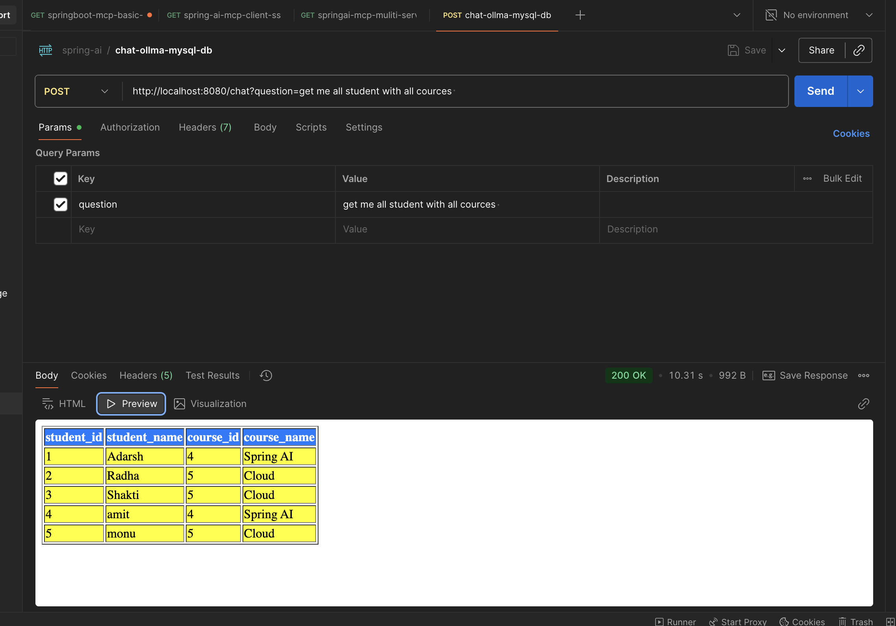

# springboot-ai-mysql-rag

---

### run ollma 
* % ollama run mistral
```
 ~ % ollama run mistral
pulling manifest 
pulling manifest 
pulling f5074b1221da: 100% ▕████████████████████████████████████████████████████████████████████████████████████████████████████████████████████████████████████████████████████████████████████▏ 4.4 GB                         
pulling 43070e2d4e53: 100% ▕████████████████████████████████████████████████████████████████████████████████████████████████████████████████████████████████████████████████████████████████████▏  11 KB                         
pulling 1ff5b64b61b9: 100% ▕████████████████████████████████████████████████████████████████████████████████████████████████████████████████████████████████████████████████████████████████████▏  799 B                         
pulling ed11eda7790d: 100% ▕████████████████████████████████████████████████████████████████████████████████████████████████████████████████████████████████████████████████████████████████████▏   30 B                         
pulling 1064e17101bd: 100% ▕████████████████████████████████████████████████████████████████████████████████████████████████████████████████████████████████████████████████████████████████████▏  487 B                         
verifying sha256 digest 
writing manifest 
success 
>>> 
>>> Send a message (/? for help)
```
```
~ % ollama ps 
NAME           ID              SIZE      PROCESSOR    CONTEXT    UNTIL              
llama3.2:1b    baf6a787fdff    2.4 GB    100% GPU     4096       4 minutes from now 
```
### run mysql
* docker run --name espark-mysql -e MYSQL_ROOT_PASSWORD=root -e MYSQL_DATABASE=esparkdb -p 3306:3306 -d mysql:latest
* docker exec -it espark-mysql mysql -uroot -proot
* docker logs espark-mysql
````
SHOW DATABASES;

CREATE DATABASE IF NOT EXISTS database_name;
 
USE espark-db;

show tables;

 % docker ps 
CONTAINER ID   IMAGE          COMMAND                  CREATED          STATUS          PORTS                                         NAMES
2c2b9dbec894   mysql:latest   "docker-entrypoint.s…"   30 minutes ago   Up 30 minutes   0.0.0.0:3306->3306/tcp, [::]:3306->3306/tcp   espark-mysql
````

* Spring Boot application with AI integration and MySQL RAG (Retrieval-Augmented Generation)

* api request 
````
curl --location --request POST 'http://localhost:8080/chat?question=get%20me%20all%20student%20with%20all%20cources%20'
````
