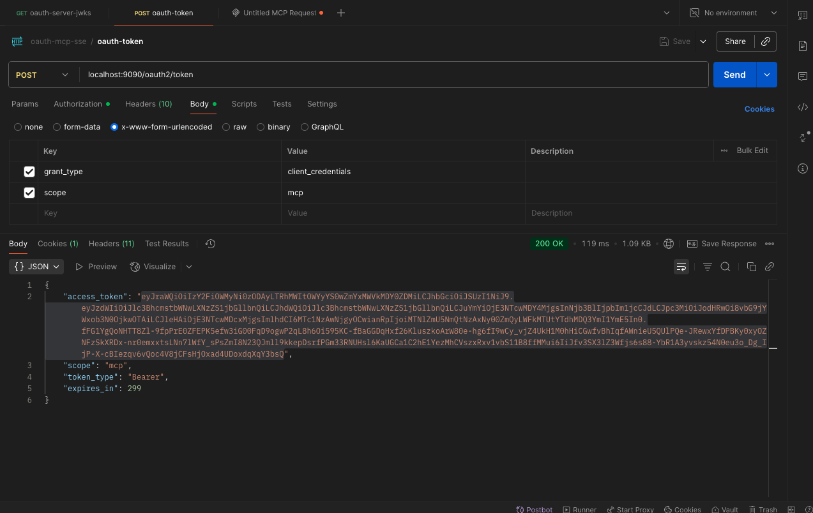
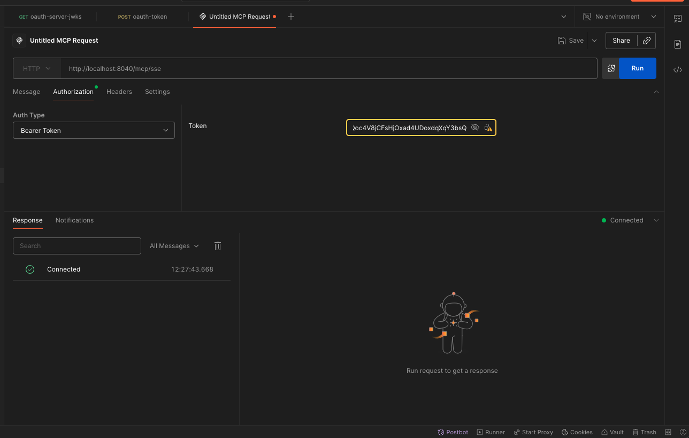
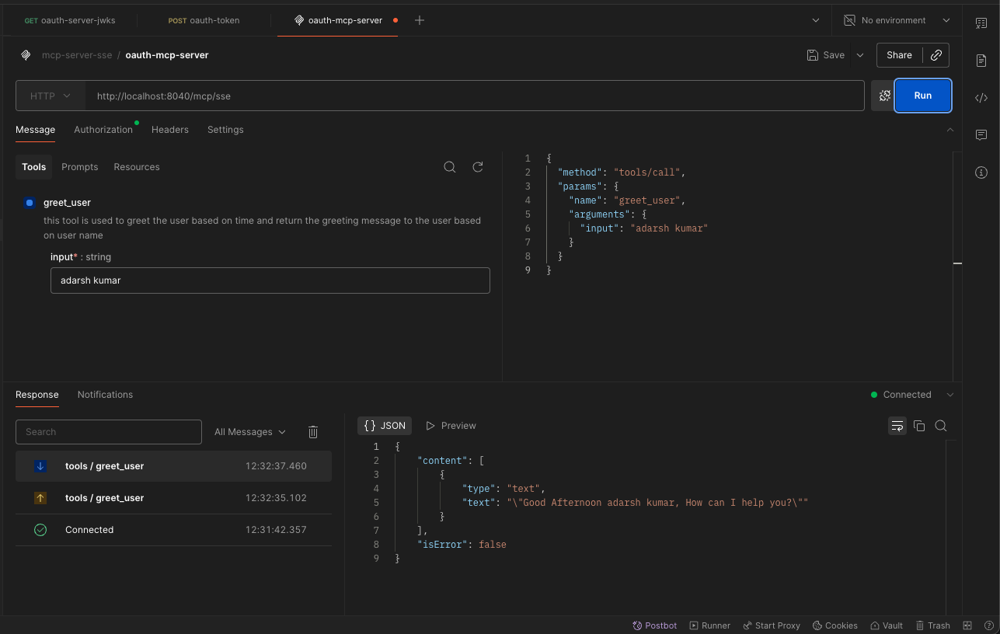

# springboot-ai-mcp-server-basic-sse

---


* To build 
```
$ mvn clean package 
```     
* to Run 
```
$ mvn spring-boot:run
```
* Get Token 
```
curl --location 'localhost:9090/oauth2/token' \
--header 'Content-Type: application/x-www-form-urlencoded' \
--header 'Authorization: ••••••' \
--header 'Cookie: JSESSIONID=E94F09DADE674391F421F9002DF4195B' \
--data-urlencode 'grant_type=client_credentials' \
--data-urlencode 'scope=mcp'
```
* OAuth Token Generation

* adding Bearer Token to Header

  * Requesting SSE Endpoint


