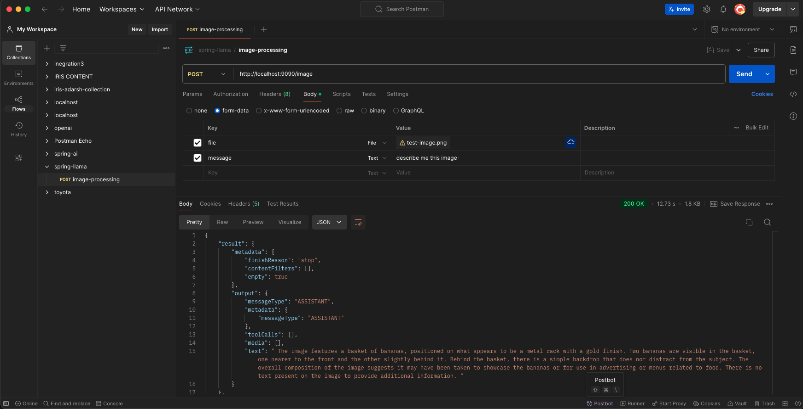
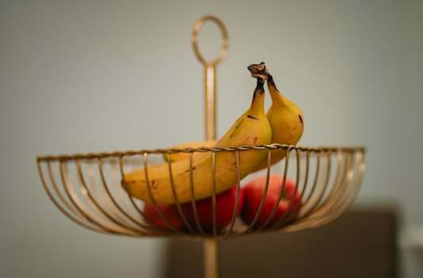

# SPRING BOOT AI OLLAMA DEEPSEEK IMAGE PROCESSING
---

[spring-ai-deepseek-doc](https://docs.spring.io/spring-ai/reference/api/chat/ollama-chat.html)

[step by step ollama guide](https://github.com/adarshkumarsingh83/spring-ai/blob/main/DOUCUMENTS/ollama.readme.md)
* To Run Ollama 
*  ollama run llava
````
pulling manifest 
pulling 170370233dd5: 100% ▕███████████████████████████████████████████████████████████████████████████████████████████████████████████████████████▏ 4.1 GB                         
pulling 72d6f08a42f6: 100% ▕███████████████████████████████████████████████████████████████████████████████████████████████████████████████████████▏ 624 MB                         
pulling 43070e2d4e53: 100% ▕███████████████████████████████████████████████████████████████████████████████████████████████████████████████████████▏  11 KB                         
pulling c43332387573: 100% ▕███████████████████████████████████████████████████████████████████████████████████████████████████████████████████████▏   67 B                         
pulling ed11eda7790d: 100% ▕███████████████████████████████████████████████████████████████████████████████████████████████████████████████████████▏   30 B                         
pulling 7c658f9561e5: 100% ▕███████████████████████████████████████████████████████████████████████████████████████████████████████████████████████▏  564 B                         
verifying sha256 digest 
writing manifest 
success 
>>> Send a message (/? for help)

````

---
## Api 

````
curl --location 'http://localhost:9090/image' \
--form 'file=@"/Users/adarshkumar/Downloads/test-image.png"' \
--form 'message="describe me this image "'
````

* response 
```
{
    "result": {
        "metadata": {
            "finishReason": "stop",
            "contentFilters": [],
            "empty": true
        },
        "output": {
            "messageType": "ASSISTANT",
            "metadata": {
                "messageType": "ASSISTANT"
            },
            "toolCalls": [],
            "media": [],
            "text": " The image features a basket of bananas, positioned on what appears to be a metal rack with a gold finish. Two bananas are visible in the basket, one nearer to the front and the other slightly behind it. Behind the basket, there is a simple backdrop that does not distract from the subject. The overall composition of the image suggests it may have been taken to showcase the bananas or for use in advertising or menus related to food. There is no text present on the image to provide additional information. "
        }
    },
    "metadata": {
        "id": "",
        "model": "llava",
        "rateLimit": {
            "tokensLimit": 0,
            "tokensReset": "PT0S",
            "requestsLimit": 0,
            "requestsRemaining": 0,
            "requestsReset": "PT0S",
            "tokensRemaining": 0
        },
        "usage": {
            "promptTokens": 590,
            "completionTokens": 108,
            "totalTokens": 698
        },
        "promptMetadata": [],
        "empty": false
    },
    "results": [
        {
            "metadata": {
                "finishReason": "stop",
                "contentFilters": [],
                "empty": true
            },
            "output": {
                "messageType": "ASSISTANT",
                "metadata": {
                    "messageType": "ASSISTANT"
                },
                "toolCalls": [],
                "media": [],
                "text": " The image features a basket of bananas, positioned on what appears to be a metal rack with a gold finish. Two bananas are visible in the basket, one nearer to the front and the other slightly behind it. Behind the basket, there is a simple backdrop that does not distract from the subject. The overall composition of the image suggests it may have been taken to showcase the bananas or for use in advertising or menus related to food. There is no text present on the image to provide additional information. "
            }
        }
    ]
}
```