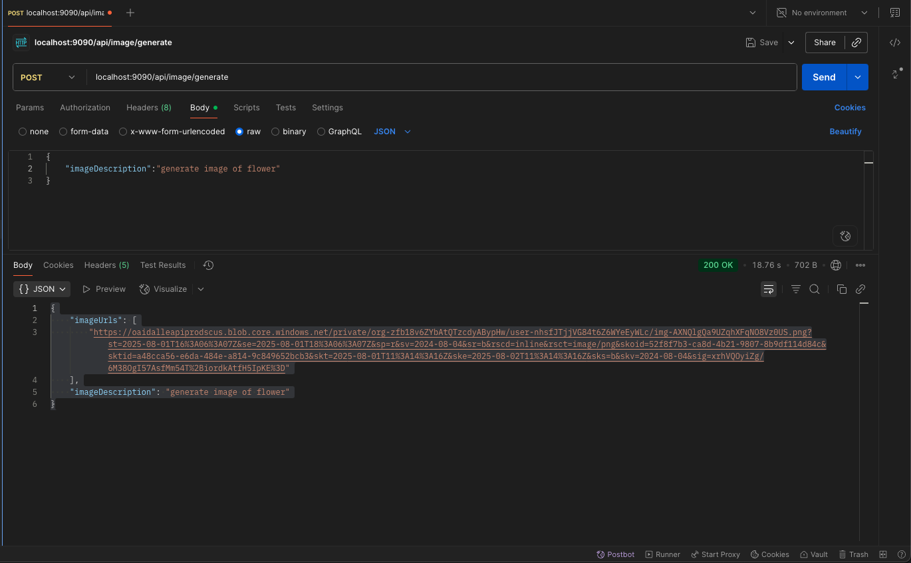

# springboot-ai-opneai-image-generation
----



* curl 
```
curl --location 'localhost:9090/api/image/generate' \
--header 'Content-Type: application/json' \
--data '{
    "imageDescription":"generate image of flower"
}'

```
* response 
```
{
    "imageUrls": [
        "https://oaidalleapiprodscus.blob.core.windows.net/private/org-zfb18v6ZYbAtQTzcdyABypHw/user-nhsfJTjjVG84t6Z6WYeEyWLc/img-AXNQlgQa9UZqhXFqNO8Vz0US.png?st=2025-08-01T16%3A06%3A07Z&se=2025-08-01T18%3A06%3A07Z&sp=r&sv=2024-08-04&sr=b&rscd=inline&rsct=image/png&skoid=52f8f7b3-ca8d-4b21-9807-8b9df114d84c&sktid=a48cca56-e6da-484e-a814-9c849652bcb3&skt=2025-08-01T11%3A14%3A16Z&ske=2025-08-02T11%3A14%3A16Z&sks=b&skv=2024-08-04&sig=xrhVQOyiZg/6M38OgI57AsfMm54T%2BiordkAtfH5IpKE%3D"
    ],
    "imageDescription": "generate image of flower"
}
```

