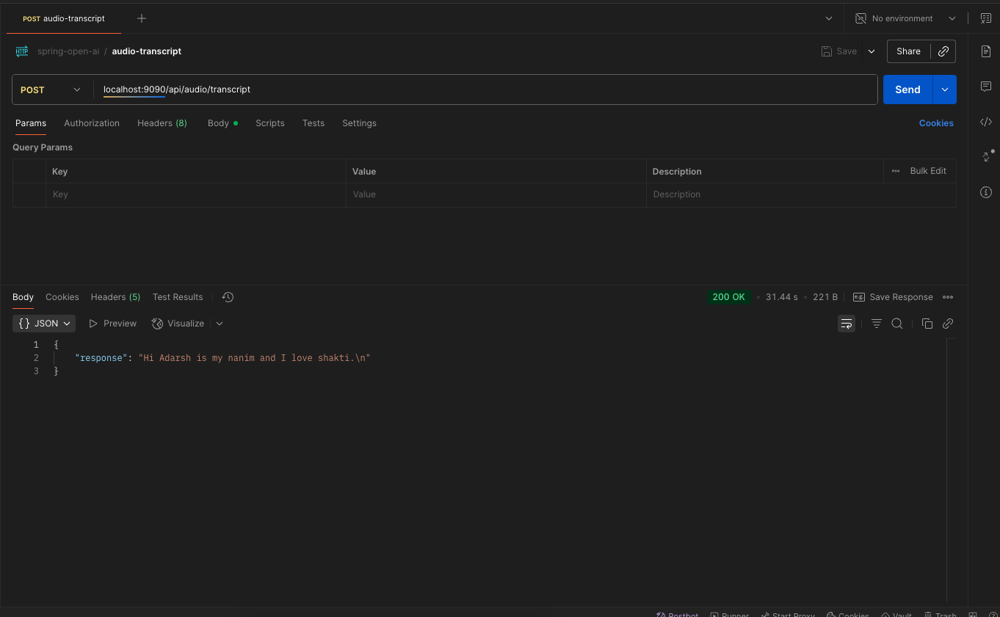

# springboot-ai-opneai-speech-to-text
----



* curl 
```
curl --location 'localhost:9090/api/audio/transcript' \
--form 'audioFile=@"/Volumes/education/GIT/spring-ai/APPLICATONS/springboot-ai-opneai-speech-to-text/audio_1754071075055.mp3"'

```
* response 
```
{
    "response": "Hi Adarsh is my nanim and I love shakti.\n"
}
```
