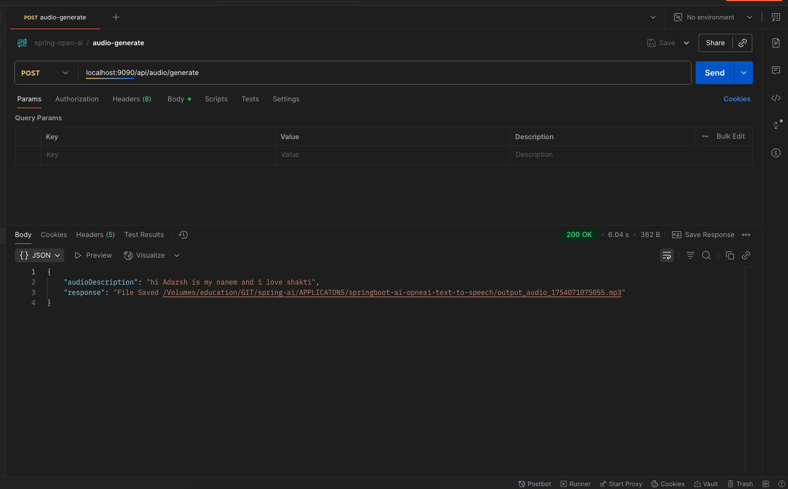

# springboot-ai-opneai-text-to-speech
----



* curl 
```
curl --location 'localhost:9090/api/audio/generate' \
--header 'Content-Type: application/json' \
--data '{
    "audioDescription":"hi Adarsh is my nanem and i love shakti"
}'

```
* response 
```
{
    "audioDescription": "hi Adarsh is my nanem and i love shakti",
    "response": "File Saved /Volumes/education/GIT/spring-ai/APPLICATONS/springboot-ai-opneai-text-to-speech/output_audio_1754071075055.mp3"
}
```
