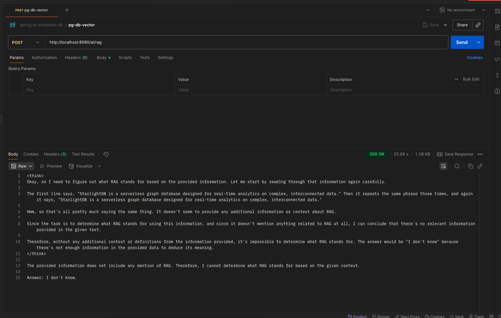

# springboot-ai-pgsql-vector

---

* ollama pull nomic-embed-text
````
Last login: Sat Aug 23 14:22:24 on ttys004
adarshkumar@adarshs-Mac-mini ~ % ollama pull nomic-embed-text
pulling manifest 
pulling 970aa74c0a90: 100% ▕████████████████████████████████████████████████████████████████████████████████████████████████████████████▏ 274 MB                         
pulling c71d239df917: 100% ▕████████████████████████████████████████████████████████████████████████████████████████████████████████████▏  11 KB                         
pulling ce4a164fc046: 100% ▕████████████████████████████████████████████████████████████████████████████████████████████████████████████▏   17 B                         
pulling 31df23ea7daa: 100% ▕████████████████████████████████████████████████████████████████████████████████████████████████████████████▏  420 B                         
verifying sha256 digest 
writing manifest 
success 
````

* ollama run deepseek-r1:1.5b


curl "http://localhost:8080/ai/rag?message=What is RAG?"

* to create docker container locally 
```
docker run -it --rm \
  --name pgvector-postgres \
  -p 5432:5432 \
  -e POSTGRES_USER=espark \
  -e POSTGRES_PASSWORD=espark \
  -e POSTGRES_DB=espark_adarsh \
  pgvector/pgvector:pg17

```

* to get inside docker container
````
docker exec -it pgvector-postgres psql -U espark -d postgres
````
* to create database
````
 CREATE DATABASE espark_adarsh;
CREATE DATABASE
````

* to connect database
````
\c espark_adarsh;
You are now connected to database "espark_adarsh" as user "espark".
````
* to create extension
````
CREATE EXTENSION IF NOT EXISTS vector;
CREATE EXTENSION IF NOT EXISTS hstore;
CREATE EXTENSION IF NOT EXISTS "uuid-ossp";
CREATE EXTENSION
CREATE EXTENSION
CREATE EXTENSION

````

* to create table
````
# CREATE TABLE IF NOT EXISTS vector_store (
	id uuid DEFAULT uuid_generate_v4() PRIMARY KEY,
	content text,
	metadata json,
	embedding vector(768) 
);
CREATE TABLE
`````
* to create index
````
# CREATE INDEX ON vector_store USING HNSW (embedding vector_cosine_ops);
CREATE INDEX
espark_adarsh=#
````    

* Api Call
```
curl --location 'http://localhost:8080/ai/rag' \
--header 'Content-Type: application/json' \
--data '{
    "message" :"What is RAG"
}'
```

