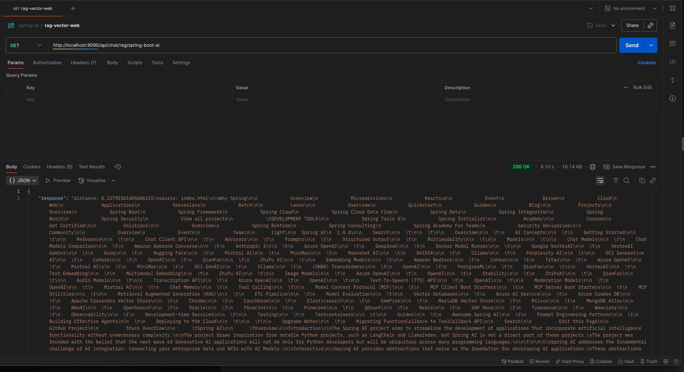

# springboot-ai-rag-vector-web-data

----



* api call 
* curl --location 'http://localhost:9090/api/chat/rag/springai'
```
{
    "response": "distance: 0.21068208454657456\n\ni prefer to work on spring boot and i like to work on spring boot",
    "subject": "springai"
}
```
